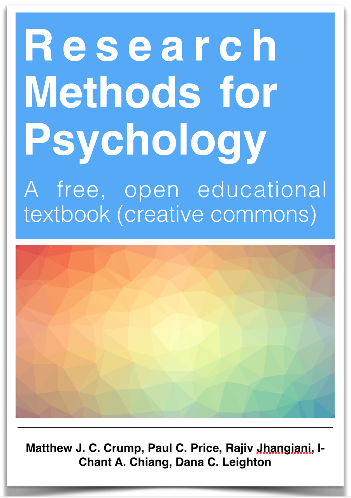

--- 
title: "Research Methods for Psychology"
author: "Matthew J. C. Crump, Paul C. Price, Rajiv Jhangiani, I-Chant A. Chiang, Dana C. Leighton"
date: "2017 Last Compiled: `r Sys.Date()`"
site: bookdown::bookdown_site
output: 
  bookdown::gitbook:
    includes:
      in_header: includeme.html
    css: tufte.css
    fontsettings:
      theme: white
      family: sans
      size: 1
documentclass: book
bibliography: [book.bib, packages.bib, MyLibrary.bib]
biblio-style: apalike
link-citations: yes
#github-repo: rstudio/bookdown-demo
description: "A research methods for Psychology Textbook"
---

# Preface {-}

```{r,echo=F,fig.align="center",eval=T}

```

*Contributing to the textbook*

1. Use Hypothes.is, an amazing tool for annotating the web.
  
  a. Go to [Hypothes.is](https://web.hypothes.is/), and "get-started"
  
  b. Install the the add-on for chrome, or other browser
  
  c. That's it, turn on Hypothes.is when you are reading this textbook, and you will see all public annotations made by anyone else.
  
2. The source code for this textbook is available in the ResearchMethods github repository.
 
 a. Edit the .Rmd files, and push them back
  
  b. The edit link in the top bar of the textbook should automatically take you to the source .Rmd file

This textbook is an adaptation of one originally written by Paul C. Price (California State University, Fresno) and adapted by The Saylor Foundation under a Creative Commons Attribution-NonCommercial-ShareAlike 3.0 License without attribution as requested by the work's original creator or licensee. The original text is available [here](http://www.saylor.org/site/textbooks/)

This adaptation constitutes the Brooklyn College edition by Matthew J. C. Crump (Brooklyn College and Graduate Center of the City University of New York). This newest adaptation incorporates the second Canadian edition by Rajiv S. Jhangiani (Kwantlen Polytechnic University) and I-Chant A. Chiang (Quest University Canada) and is licensed under a Creative Commons Attribution-NonCommercial-ShareAlike 4.0 International License. And, incorporates the second U.S. edition authored by Dana C. Leighton (Southern Arkansas University) and is licensed under a Creative Commons Attribution-NonCommercial-ShareAlike 4.0 International License. 

Revisions in the current edition are listed by the change logs in the github repository [here](https://github.com/CrumpLab/ResearchMethods) 

Research Methods in Psychology - Brooklyn College Edition by Paul C. Price, Rajiv Jhangiani, I-Chant A. Chiang, Dana C. Leighton, & Matthew J. C. Crump is licensed under a Creative Commons Attribution-NonCommercial-ShareAlike 4.0 International License, except where otherwise noted.

